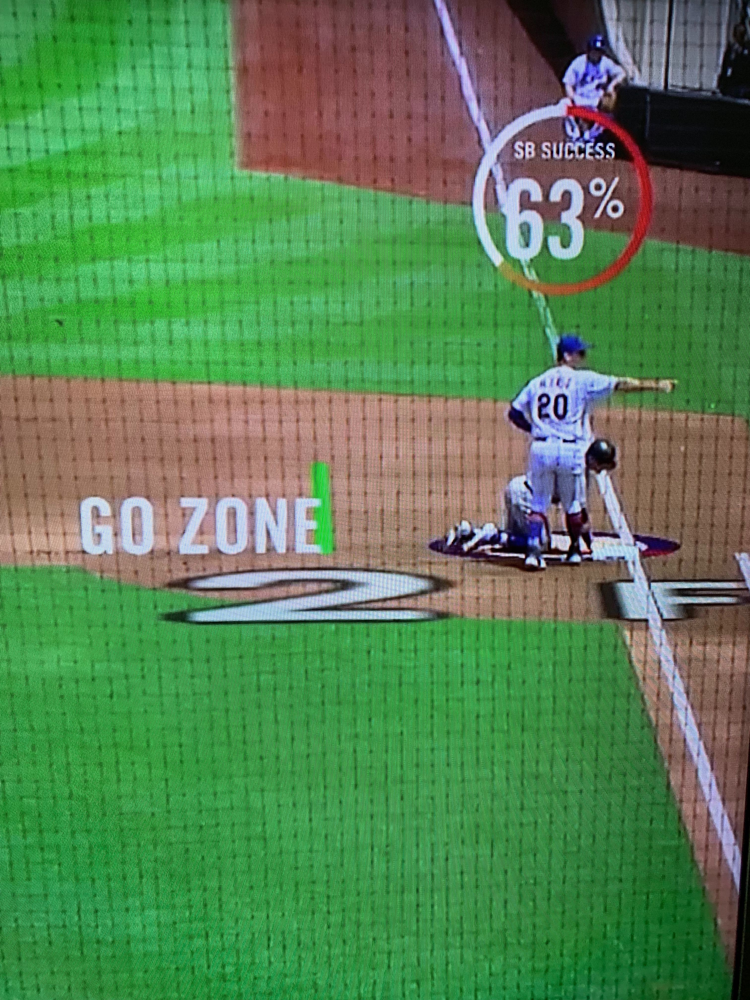

***Discussed:*** *Knocking space down a frontier (or two because the ocean), Top Gun, 5G, forgoing bipedalism, neural networks, rock solid stuff, speculative stuff, pointing, designated zones, gambling*

Speed: the final frontier. Everyone wants speed in as many ways as possible. Americans love fast cars. Put the top down or absent a convertible
your hand out the window and pretend its a Tom-Cruise-piloted supersonic war machine. Give the Russians the bird. 
Give us the food fast. Put that burger in your mouth and down your gullet. Make sure you don't waste time even breathing. You want to get rich? The most reliable way
to do it is quickly. Hey what's up with your slow terrible Internet? Only Prime Shipping otherwise I'm moving on. I spit on your 4G because only the fastest everything please and thank you.

The paragon of speed in Major League Baseball is Rockies' shortstop Trevor Story. This is a man who, as affirmed by–get this–Statcast AI powered by AWS, 
is able to steal bases 63% of time when starting from–get this–his hands and knees. This is according to science and math and computers. Amazon has "trained a deep neural network 
to predict stolen base success by using numerous data including runner's speed and burst, catcher's pop time, pitcher's velocity and handedness, lead-off distance, and the game situation".
That is rock solid stuff right there. 

Below we have visual proof of machine learning's proof of Trevor Story's freak-of-nature nature when it comes to stolen base prowess thanks to Amazon's impressive
real time integration of its science into in-game graphics, which obviously requires sub-second response times from its model. Notice not only is Story on his hands and knees, he is
not even leading off, he's literally touching first base. Making things more impressive, he has decided to not look at second base, instead facing away from second base and looking at 
either the ground or whatever Mets' first baseman Pete Alonso is pointing at. It's impossible to tell for sure what he's looking at except that it's not second base. Also possible is that 
Pete Alonso is amazed that Trevor is looking at not second base and is like pointing at what he thinks Trevor is looking at saying probably,
"I can't believe you're looking at that!" That's totally possible too. Pete Alonso could also be indicating to his dugout to investigate whether or not 
a replay is in order. We can't be 100% sure in terms of what everyone is looking at or saying or pointing at and for what reasons. 
We do know 100% for sure though that Pete Alonso is holding the baseball. We know because the reason Trevor is in that quadrupedaled position is because a moment 
before this image was captured the pitcher Noah Syndergaard threw the ball to Pete Alonso over at first base trying to pick Trevor off presumably because he's so fast. 
So Trevor dove and slid back to first base like you're supposed to when someone tries to pick you off.

So anyway, that's the situation; the 63-percent-chance-of-a-successful-stolen-base situation. Trevor Story is on his hands and knees, 
facing away from second base with Pete Alonso who is holding the baseball and pointing at something, could be anything, plus we don't know for sure what Trevor is even looking at 
in that moment, and Trevor is not even in the fucking Go Zone–we haven't even mentioned the being outside the Go Zone bit. Given this set of variables a betting 
man would not bet on a successful stolen base, especially because of the Go Zone part since that's presumably the only Zone where you Go. 
To that science and math and computers say not so fast, betting man. Not so fast. 

